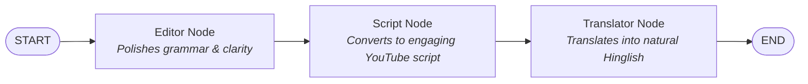
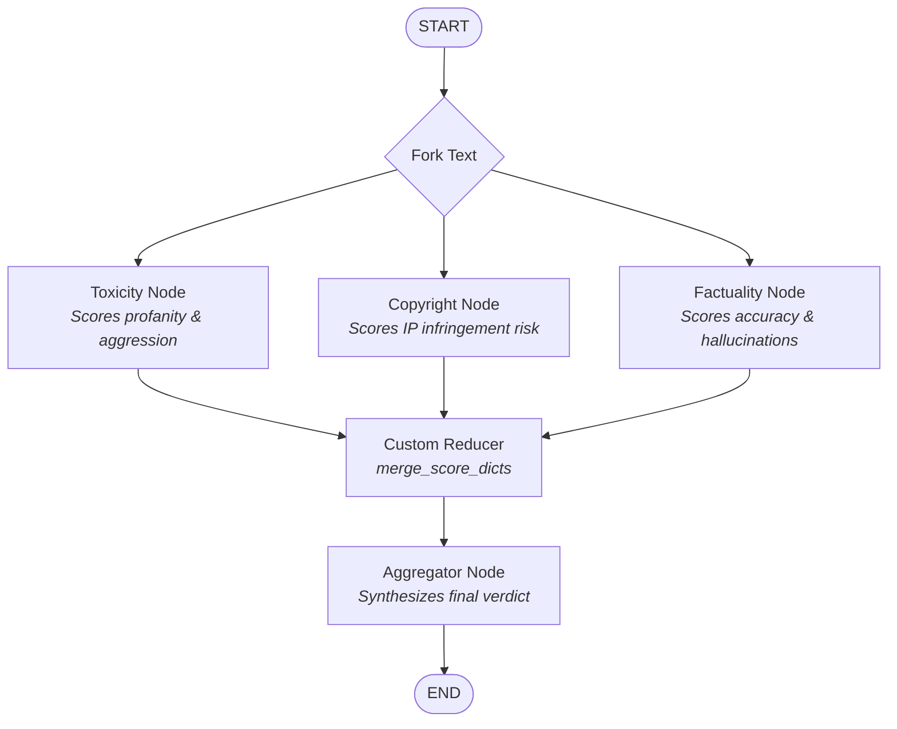
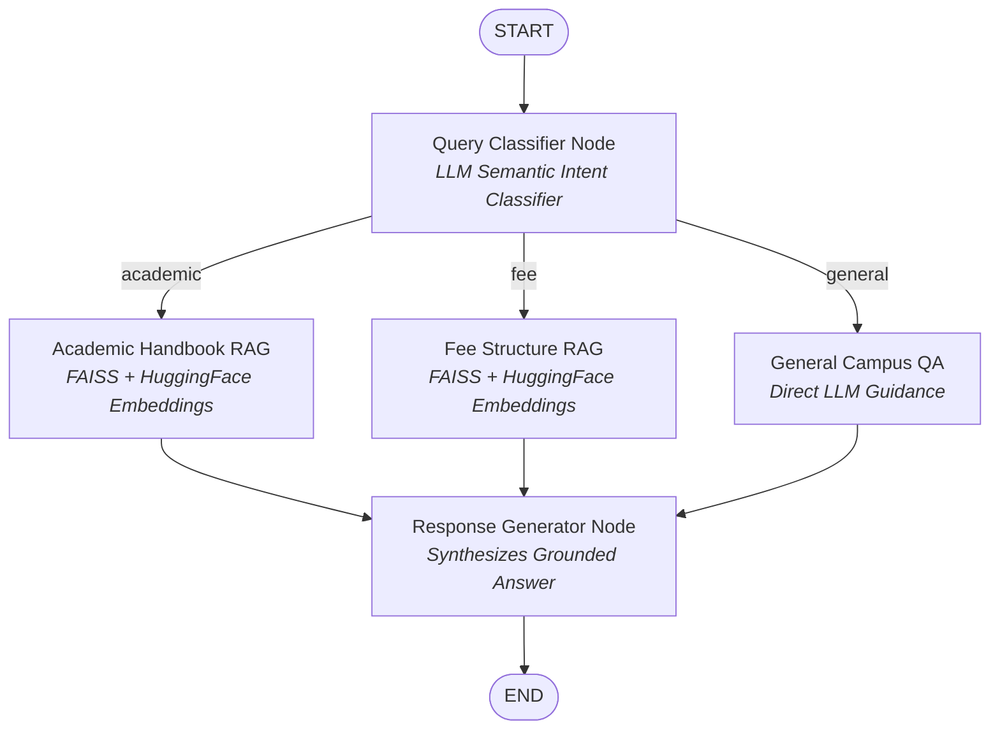
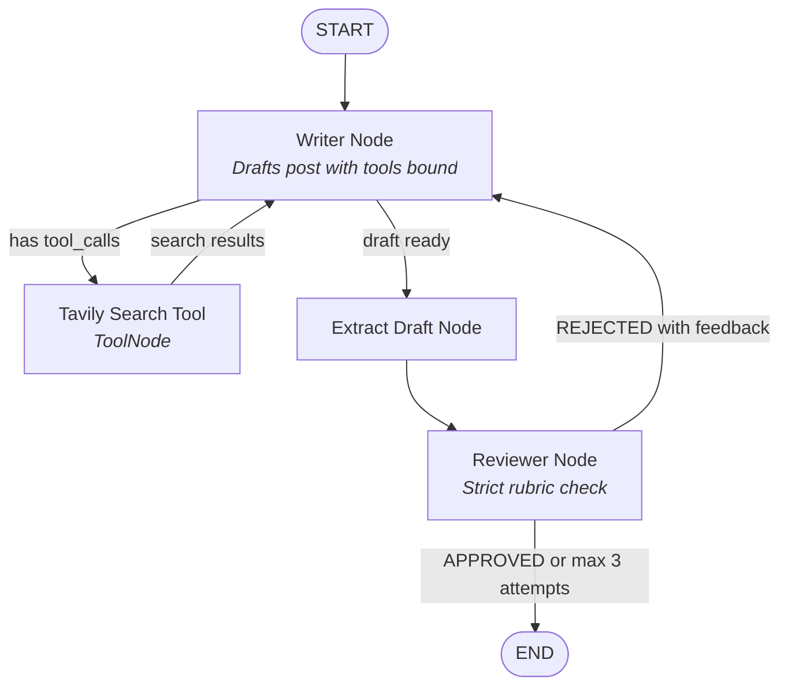
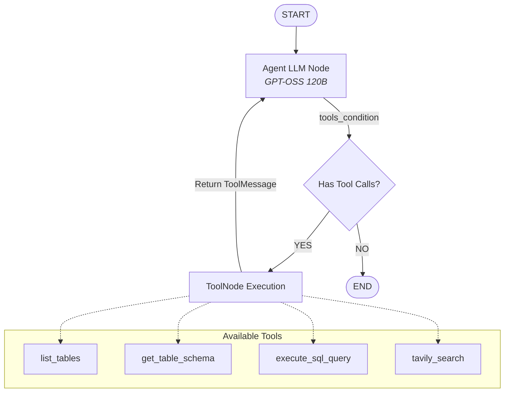

# 🚀 Agentic AI & LangGraph: End-to-End Master Repository

[](https://www.python.org/)
[](https://github.com/langchain-ai/langgraph)
[](https://github.com/langchain-ai/langchain)
[](https://groq.com/)
[](https://streamlit.io/)
[](https://github.com/astral-sh/uv)

A production-grade, end-to-end repository mastering **Agentic AI Architecture** using **LangGraph**. This repository covers everything from foundational sequential pipelines and parallel state reducers to self-correcting ReAct agents, dynamic multi-route RAG engines, interactive Streamlit applications, and modern Human-in-the-Loop (HITL) checkpoints.

---

## 📑 Table of Contents

- [Architectural Overview](#-architectural-overview)
- [Workflow Implementations & Diagrams](#-workflow-implementations--diagrams)
  - [1. Sequential Pipeline (`seuential_base.py`)](#1-sequential-pipeline-seuential_basepy)
  - [2. Parallel Branching & Reducers (`parallel_reducer.py`)](#2-parallel-branching--reducers-parallel_reducerpy)
  - [3. Multi-Route Conditional RAG (`conditional_rag.py` & `campus_rag_app.py`)](#3-multi-route-conditional-rag-conditional_ragpy--campus_rag_apppy)
  - [4. Iterative Workflows (Self-Correction & Feedback Loops)](#4-iterative-workflows-self-correction--feedback-loops)
    - [4A. Evaluator-Optimizer Loop (`iterative_tools.py`)](#4a-evaluator-optimizer-loop-iterative_toolspy)
    - [4B. Environment-Driven ReAct SQL Agent (`sql_agent.py` & `sql_app.py`)](#4b-environment-driven-react-sql-agent-sql_agentpy--sql_apppy)
  - [5. Human-in-the-Loop HITL (`humanintheloop.py`)](#5-human-in-the-loop-hitl-humaninthelooppy)
- [Repository Structure](#-repository-structure)
- [Technology Stack](#-technology-stack)
- [Interactive Streamlit Web Apps](#-interactive-streamlit-web-apps)
- [Master Interview Guide (`interview.md`)](#-master-interview-guide-interviewmd)
- [Getting Started & Setup](#-getting-started--setup)
- [Running Workflows](#-running-workflows)

---

## 🧠 Architectural Overview

Traditional LLM workflows rely on rigid, linear chains (LangChain `Chain`) that struggle with dynamic branching, cyclic loops, error recovery, and persistence. 

This repository leverages **LangGraph**, representing workflows as **Cyclic Directed Graphs** where:
- **State**: The unified, evolving memory passed across the pipeline (`TypedDict`, `Pydantic`, or `dataclass`).
- **Nodes**: Standard Python functions or LLM agents that execute logic and return state updates.
- **Edges & Conditional Routers**: Define the exact control flow, dynamically branching based on LLM decisions or business rules.
- **Reducers**: Handle parallel writes and state synchronization without race conditions.
- **Checkpointers**: Persist execution state per thread for seamless **pause & resume** (Human-in-the-Loop).

---

## 📊 Workflow Implementations & Diagrams

### 1. Sequential Pipeline (`seuential_base.py`)
A linear pipeline demonstrating multi-stage text refinement where each node takes the output of the prior step and transforms it.



- **Core Concept**: Unidirectional state propagation through dedicated state keys.
- **State**: `PipelineState` tracking `raw_input`, `edited_text`, `scripted_text`, and `final_output`.

---

### 2. Parallel Branching & Reducers (`parallel_reducer.py`)
Executes multiple independent LLM evaluators concurrently and combines their scores into a single unified safety score using a **custom state reducer**.



- **Core Concept**: Parallel evaluation with `Annotated[dict, merge_score_dicts]`. Avoids state overwrite conflicts by merging partial dictionaries from parallel nodes.

---

### 3. Multi-Route Conditional RAG (`conditional_rag.py` & `campus_rag_app.py`)
An enterprise campus assistant that intelligently classifies student queries and routes them to specialized vector indexes (Academic Handbook, Fee Structure) or a general campus guidance stream.



- **Vector Store**: FAISS with `all-MiniLM-L6-v2` embeddings.
- **Frontend**: Full-featured interactive Streamlit app in [`campus_rag_app.py`](campus_rag_app.py).

---

### 4. Iterative Workflows (Self-Correction & Feedback Loops)

Iterative workflows are central to Agentic AI. To master them completely, this repository implements the **two fundamental flavors** of self-correcting loops:
1. **Semantic Evaluator-Optimizer**: An LLM reviewer evaluates text against qualitative rubrics and gives feedback for rewrites.
2. **Environment-Driven ReAct**: The agent interacts with a live runtime (database/compiler/tools) and fixes runtime errors autonomously.

---

#### 4A. Evaluator-Optimizer Loop (`iterative_tools.py`)
An autonomous writer-and-critic loop that writes content, searches the live web for fresh facts via Tavily, and submits the draft to a strict reviewer. If rejected, it rewrites the draft incorporating specific feedback until approved or hitting max attempts.



- **Core Concept**: Self-correcting feedback loop guided by an LLM Evaluator (`reviewer_node`) and conditional edges (`should_stop_looping`).

---

#### 4B. Environment-Driven ReAct SQL Agent (`sql_agent.py` & `sql_app.py`)
An enterprise-grade ReAct data analyst agent connected to a real SQLite database (`company.db`). The agent introspects schemas, writes SQL queries, automatically self-corrects syntax/case-sensitivity errors reported by SQLite, and falls back to Tavily web search for industry benchmarks.



- **Core Concept**: Autonomous error-healing in a live execution environment using LangGraph's pre-built `ToolNode` and `tools_condition`.
- **Features**: Case-insensitive SQLite execution (`COLLATE NOCASE`), dynamic error retry, and complete Streamlit dashboard in [`sql_app.py`](sql_app.py).

---

### 💡 Comparison: The Two Flavors of Iterative Workflows

| Dimension | 4A. Evaluator-Optimizer Loop ([`iterative_tools.py`](iterative_tools.py)) | 4B. Environment ReAct Self-Correction ([`sql_agent.py`](sql_agent.py)) |
| :--- | :--- | :--- |
| **Primary Goal** | Perfecting content quality & adhering to strict rubrics | Autonomous task execution & environment error-healing |
| **Feedback Source** | **Semantic / LLM Reviewer** (Evaluator Node) | **Deterministic / Tool Runtime** (SQLite DB / Compiler / API) |
| **Feedback Type** | Natural language critique (`"Lacks hook, add CTA"`) | Exact error message (`"no such column: Engineering"`) |
| **Routing Mechanism**| Custom conditional edge (`should_stop_looping`) | Pre-built `tools_condition` checking `tool_calls` |
| **Loop Structure** | `Writer ➔ ToolNode ➔ Writer ➔ Reviewer ➔ Writer` | `Agent ➔ ToolNode ➔ Agent (ReAct cycle)` |
| **Max Retry Guard** | Counter in state (`attempt >= 3`) | Graph recursion limit (`recursion_limit=25`) |
| **Real-World Uses** | Marketing copy, code generation with reviewer, PR drafting | Autonomous SQL analysis, API retries, terminal debugging |

---

### 5. Human-in-the-Loop HITL (`humanintheloop.py`)
Demonstrates modern LangGraph HITL using the runtime `interrupt()` primitive, `Command(resume=...)`, and thread persistence via `MemorySaver`.

```mermaid
sequenceDiagram
    autonumber
    actor User as Human Manager
    participant App as LangGraph Engine
    participant Node as Node (interrupt)
    participant Memory as Checkpointer (MemorySaver)

    App->>Node: Execute workflow with thread_id
    Note over Node: Check refund amount ($500)
    Node->>App: interrupt(approval request payload)
    App->>Memory: Freeze state & save checkpoint
    App-->>User: Workflow pauses; UI presents approval prompt
    User->>App: app.invoke(Command(resume=decision))
    App->>Memory: Load checkpoint for thread_id
    App->>Node: Inject resume value into interrupt() call
    Note over Node: Resumes execution immediately!
    Node->>App: Return final APPROVED state
```

- **Core Primitives**:
  - `interrupt(value)`: Pauses execution mid-node and yields context to the caller.
  - `Command(resume=value)`: Wakes up the exact thread and injects the human response.
  - `MemorySaver`: In-memory checkpointing (swap with `SqliteSaver` or `PostgresSaver` in production).

---

## 📁 Repository Structure

```text
agentic-ai-langGraph/
├── campus_rag_app.py        # Streamlit UI for Multi-Route Campus Copilot
├── conditional_rag.py       # LangGraph state machine for Multi-Route RAG
├── sql_app.py               # Streamlit UI for ReAct SQL Data Analyst
├── sql_agent.py             # ReAct SQL Agent with SQLite & Tavily tools
├── iterative_tools.py       # Iterative Writer-Reviewer feedback loop with Tavily
├── humanintheloop.py        # Human-in-the-Loop using interrupt() & Command(resume=)
├── parallel_reducer.py      # Parallel branch execution using custom dictionary reducers
├── seuential_base.py        # Sequential multi-stage text transformation pipeline
├── states.py                # Architectural guide to defining states in LangGraph
├── interview.md             # 16-question Master Interview Guide on Agentic AI & LangGraph
├── company.db               # SQLite database (employees, orders) for SQL Agent
├── academics_handbook.pdf   # RAG source document for college syllabus & exam rules
├── fee_structure.pdf        # RAG source document for college tuition & fee schedules
├── langgraph.json           # LangGraph CLI server deployment configuration
├── pyproject.toml           # Project dependencies managed via Astral uv
└── requirements.txt         # Standard pip-compatible dependencies
```

---

## 🛠️ Technology Stack

| Component | Technology | Description |
|---|---|---|
| **Orchestration** | [LangGraph](https://github.com/langchain-ai/langgraph) (`v1.0.1`) | Stateful, multi-agent cyclic graph orchestration |
| **LLM Framework** | [LangChain](https://github.com/langchain-ai/langchain) (`v0.3`) | Prompt templates, tools, and message abstractions |
| **LLM Inference** | [Groq](https://groq.com/) | Ultra-low latency inference (`openai/gpt-oss-120b`) |
| **Search Engine** | [Tavily AI](https://tavily.com/) | Search API optimized for LLM agents and factual grounding |
| **Embeddings** | [HuggingFace](https://huggingface.co/) | `sentence-transformers/all-MiniLM-L6-v2` for dense retrieval |
| **Vector Index** | [FAISS](https://github.com/facebookresearch/faiss) | In-memory similarity search for RAG documents |
| **Database** | [SQLite3](https://www.sqlite.org/) | Relational database for SQL agent queries |
| **UI Framework** | [Streamlit](https://streamlit.io/) (`v1.63+`) | Obsidian dark theme dashboards with live streaming |
| **Environment** | [Astral uv](https://github.com/astral-sh/uv) | High-performance Python package & project manager |

---

## 💻 Interactive Streamlit Web Apps

### 1. Campus RAG Copilot (`campus_rag_app.py`)
A tailored student assistant with:
- Multi-route classification badge displays (`ACADEMIC`, `FEE`, `GENERAL`).
- Active academic programme selector (`BCA`, `BBA`, `B.Com (H)`).
- Instant quick-question action chips.

Launch with:
```bash
uv run streamlit run campus_rag_app.py --server.port 8501
```

### 2. SQL & Data Analyst Agent (`sql_app.py`)
An interactive business intelligence copilot with:
- Live SQLite database table explorer with interactive `st.dataframe`.
- Real-time tool execution trajectory inside collapsible `st.expander` components.
- Auto-remediation of invalid SQL queries and external Tavily market research.

Launch with:
```bash
uv run streamlit run sql_app.py --server.port 8502
```

---

## 📖 Master Interview Guide (`interview.md`)

This repository includes a production-grade 16-chapter interview handbook ([`interview.md`](interview.md)) covering:

1. **Agentic AI vs Generative AI**: Shift from static prediction to goal-directed autonomous loops.
2. **The Agent Spectrum**: Levels of autonomy from simple prompt-response to long-horizon agents.
3. **`create_react_agent` Internals**: How ReAct loops run under the hood.
4. **LangGraph vs LangChain**: Why cyclic graphs outperform linear chains for complex apps.
5. **Key LangGraph Features**: Statefulness, cyclicity, persistence, streaming, and breakpoints.
6. **Core Primitives**: Deep dive into State, Nodes, Edges, and Compilers.
7. **Defining State**: `TypedDict`, `Pydantic BaseModel`, `dataclass`, and `MessageState`.
8. **Workflow Patterns**: Sequential, Parallel, Routing, Iterator, and Evaluator-Optimizer.
9. **Reducers**: Handling concurrent state updates with `operator.add` and custom reducers.
10. **Routers**: Deterministic rule-based routers vs semantic LLM classification routers.
11. **`add_messages`**: Append-only message history, deduplication, and ID replacement.
12. **Iterative Workflows**: Building self-correcting critique and feedback loops.
13. **Real-world iterative problem statements**: Financial, code generation, and SQL workflows.
14. **Tool Calling Mechanics**: Why `response.content` is empty when `tool_calls` are emitted.
15. **`tools_condition`**: How LangGraph's pre-built ReAct router works under the hood.
16. **Human-in-the-Loop (HITL)**: Detailed mechanics of `interrupt()` and `Command(resume=...)`.

---

## ⚡ Getting Started & Setup

### 1. Clone the Repository
```bash
git clone https://github.com/your-username/agentic-ai-langGraph.git
cd agentic-ai-langGraph
```

### 2. Environment Configuration
Create a `.env` file in the project root:
```ini
GROQ_API_KEY=gsk_your_groq_api_key_here
TAVILY_API_KEY=tvly_your_tavily_api_key_here
```

### 3. Install Dependencies
Using **uv** (recommended for ultra-fast setup):
```bash
uv sync
```
Or using standard pip:
```bash
pip install -r requirements.txt
```

---

## 🏃 Running Workflows

### Run the Sequential Pipeline
```bash
uv run python seuential_base.py
```

### Run Parallel Branching with Reducers
```bash
uv run python parallel_reducer.py
```

### Run Iterative Writer-Reviewer Loop
```bash
uv run python iterative_tools.py
```

### Run SQL ReAct Agent in CLI
```bash
uv run python sql_agent.py
```

### Run Human-in-the-Loop Demonstration
```bash
uv run python humanintheloop.py
```

---

## 📜 License
This project is open-source and available under the [MIT License](LICENSE).
